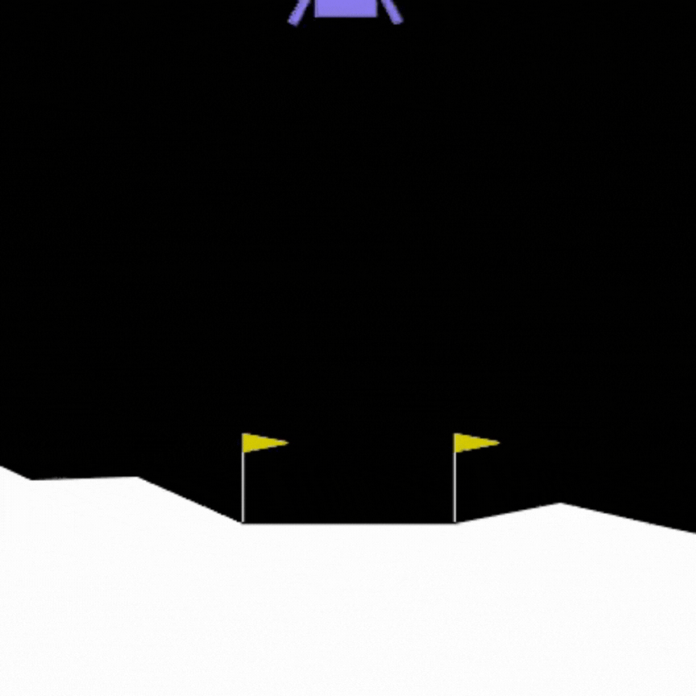

# 🚀 A Comparative Study of Reinforcement Learning Algorithms on the Lunar Lander Environment

<p align="center">
  
</p>


A comprehensive reinforcement learning project comparing **value-based** and **policy gradient** methods on the LunarLander-v3 environment from Gymnasium.


## 📋 Overview

This project implements and compares four reinforcement learning algorithms:

| Algorithm | Type | Description |
|-----------|------|-------------|
| **DQN** | Value-based | Deep Q-Network with experience replay and target network |
| **DDQN** | Value-based | Double DQN to reduce overestimation bias |
| **REINFORCE** | Policy Gradient | Monte Carlo policy gradient with optional baseline |
| **A2C** | Actor-Critic | Advantage Actor-Critic with n-step returns |

## 🎮 Environment

**LunarLander-v3** from Gymnasium:
- **State space**: 8-dimensional continuous (position, velocity, angle, leg contact)
- **Action space**: 4 discrete actions (no-op, left engine, main engine, right engine)
- **Reward**: +100 for landing, -100 for crashing, small rewards for movement towards pad
- **Goal**: Land safely between the flags with minimal fuel usage

## 📁 Project Structure

```
├── DQN_run.ipynb          # DQN/DDQN training notebook
├── PG_run.ipynb           # REINFORCE/A2C training notebook
├── game.py                # Manual play with keyboard controls
├── requirements.txt       # Dependencies
├── src/
│   ├── agents/
│   │   ├── epsilon_greedy_agent.py   # ε-greedy action selection
│   │   ├── stochastic_agent.py       # Stochastic policy sampling
│   │   └── random_agent.py           # Random baseline
│   ├── networks/
│   │   ├── q_network.py              # Q-Network (128→256→512→4)
│   │   └── policy_network.py         # Policy & Value Networks
│   ├── replay/
│   │   └── replay_buffer.py          # Experience replay buffer
│   ├── training/
│   │   ├── DQN_trainer.py            # DQN with soft/hard target updates
│   │   ├── DDQN_trainer.py           # Double DQN trainer
│   │   ├── REINFORCE_trainer.py      # REINFORCE with optional baseline
│   │   ├── A2C_trainer.py            # N-step A2C with parallel envs
│   │   └── episode_outcome.py        # Outcome classification
│   └── envs/
│       └── make_env.py               # Environment factory
├── runs/
│   ├── all_configs_combined.csv      # Hyperparameters for all experiments
│   ├── all_runs_combined.csv         # Training logs for all experiments
│   ├── runs_comparison.ipynb         # Analysis and comparison notebook
│   └── sample_runs_list/             # Individual run logs
└── videos/                           # Recorded agent videos
```

## 🔧 Installation

```bash
# Clone the repository
git clone https://github.com/yourusername/Lunar_Lander_Reinforcement_Learning.git
cd Lunar_Lander_Reinforcement_Learning

# Create virtual environment
python -m venv .venv
.venv\Scripts\activate  # Windows
# source .venv/bin/activate  # Linux/Mac

# Install dependencies
pip install -r requirements.txt
```

## 🚀 Usage

### Train DQN / Double DQN

Open `DQN_run.ipynb` and configure hyperparameters:

```python
model_type = 'DQN'        # 'DQN' or 'DDQN'
num_episodes = 800
learning_rate = 0.0001
gamma = 0.99
update_mode = 'soft'      # 'soft' or 'hard'
tau = 1e-3                # Soft update rate
epsilon_decay_value = 0.995
```

### Train REINFORCE / A2C

Open `PG_run.ipynb` and configure:

```python
model_type = 'REINFORCE'      # 'REINFORCE' or 'A2C'
num_episodes = 800
learning_rate = 0.001         # Actor/policy learning rate
gamma = 0.99                  # Discount factor
max_grad_norm = 2.0           # Gradient clipping (None to disable)

# REINFORCE specific
baseline = True               # Use value baseline for variance reduction
value_learning_rate = 0.001   # Critic/value network learning rate

# A2C specific
n_envs = 1                    # Number of parallel environments
n_steps = 10                  # N-step returns
train_every = 1               # Update frequency
```

### Play Manually

```bash
python game.py
```
- **↑** Main engine
- **←** Left engine  
- **→** Right engine
- **ESC** Quit

## 🧠 Algorithms

### DQN (Deep Q-Network)

Uses experience replay and a fixed target network for stable training:

$$Q(s,a) \leftarrow r + \gamma \max_{a'} Q_{target}(s', a')$$

**Key features:**
- Replay buffer (default: 50,000 transitions)
- Target network with soft update ($\tau = 0.001$) or hard update
- ε-greedy exploration with decay

### Double DQN

Decouples action selection from evaluation to reduce overestimation:

$$Q(s,a) \leftarrow r + \gamma Q_{target}(s', \arg\max_{a'} Q_{online}(s', a'))$$

### REINFORCE

Monte Carlo policy gradient with optional baseline for variance reduction:

$$\nabla_\theta J(\theta) = \mathbb{E}\left[\sum_t \nabla_\theta \log \pi_\theta(a_t|s_t) \cdot \delta_t\right]$$

Where $\delta_t = G_t - V(s_t)$ when using baseline.

**Key features:**
- Gradient clipping for stability

### A2C (Advantage Actor-Critic)

N-step returns with separate actor and critic networks:

$$G_t^{(n)} = r_t + \gamma r_{t+1} + ... + \gamma^{n-1} r_{t+n-1} + \gamma^n V(s_{t+n})$$

**Key features:**
- N-step bootstrapping (configurable)
- Gradient clipping for stability

## 📊 Experiments

Over 50 experiments tracked in `runs/all_configs_combined.csv`:


Analyze results with `runs/runs_comparison.ipynb`.

## 📈 Results

Episode outcomes are classified as:
- 🟢 **Landed Success**: Safe landing (+100 reward)
- 🔴 **Crashed**: Ground collision (-100 reward)
- 🟡 **Out of Bounds**: Left viewport
- 🔵 **Time Limit**: Exceeded 1000 steps

## 🛠️ Network Architectures

### Q-Network (DQN/DDQN)
```
Input(8) → FC(128) → ReLU → FC(256) → ReLU → FC(512) → ReLU → FC(4)
```

### Policy Network (REINFORCE/A2C)
```
Input(8) → FC(16) → ReLU → FC(16) → ReLU → FC(16) → ReLU → FC(4) → Softmax
```

### Value Network (Baseline/Critic)
```
Input(8) → FC(16) → ReLU → FC(16) → ReLU → FC(16) → ReLU → FC(1)
```

## 📚 References

### LunarLander-Specific Studies
- [Comparison and Hyperparameter Analysis of Four Reinforcement Learning Algorithms in the Lunar Lander Environment](https://doi.org/10.1007/978-981-97-2200-6_24) - Y. Lu, Springer 2024
- [Comparison of Three Deep Reinforcement Learning Algorithms for Solving the Lunar Lander Problem](https://doi.org/10.2991/978-94-6463-370-2_21) - D. Shen, DAI 2023
- [Evaluating Reinforcement Learning algorithms for LunarLander-v2: A Comparative Analysis](https://doi.org/10.21203/rs.3.rs-5939959/v2) - A. Awasthi, 2025
- [LunarLander-v2 REINFORCE Implementation](https://github.com/riccardocadei/LunarLander-v2-REINFORCE) - R. Cadei

## 📄 License

This project is for educational purposes as part of the Data Science program at University of Trento.
